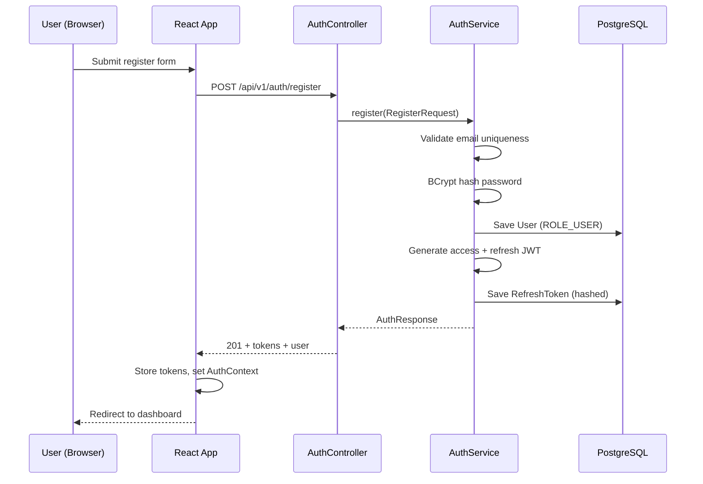
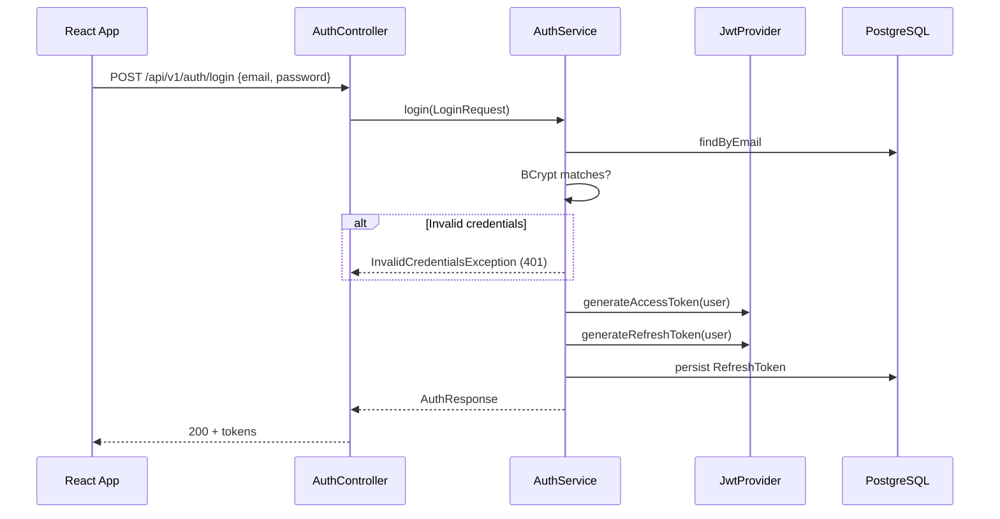
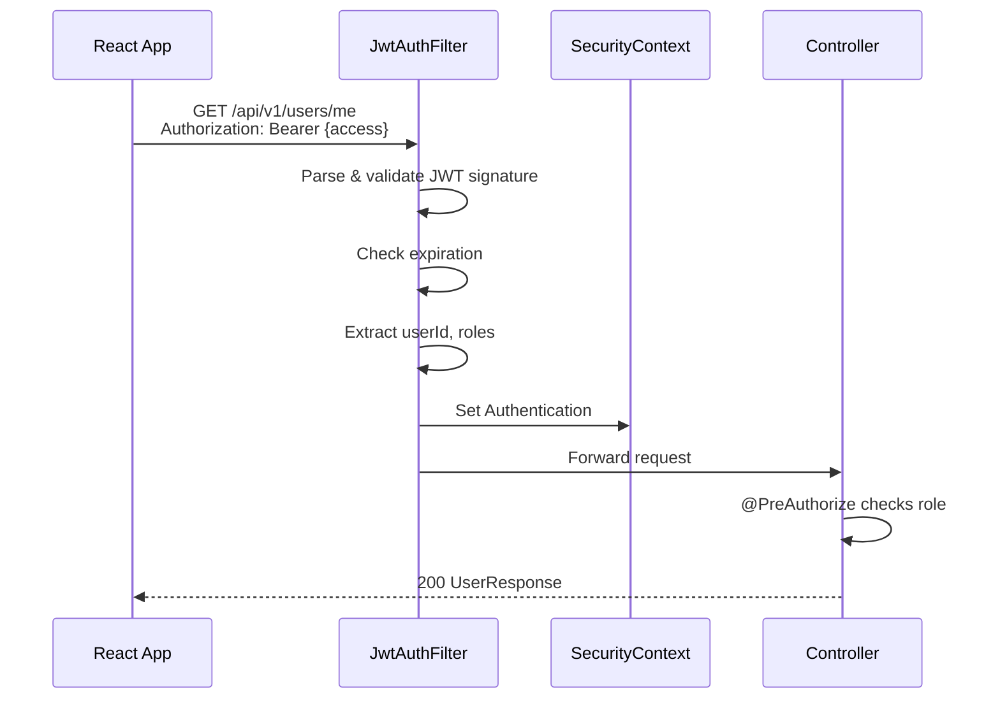
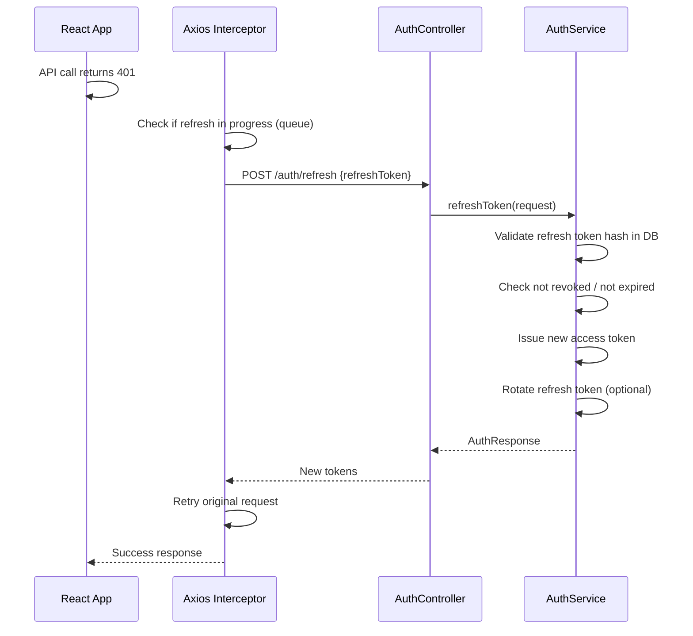

# BetterChoice AI — Authentication Flow

## Overview

BetterChoice AI uses **stateless JWT authentication** with short-lived access tokens and long-lived refresh tokens. Passwords are hashed with BCrypt. Spring Security filter chain validates every protected request.

## Token Strategy

| Token | Lifetime | Storage (Frontend) | Purpose |
|-------|----------|-------------------|---------|
| Access Token | 15 minutes | Memory / sessionStorage | API authorization |
| Refresh Token | 7 days | HttpOnly cookie (preferred) or secure storage | Obtain new access token |

## Registration Flow



## Login Flow



## Protected Request Flow



## Token Refresh Flow



## Logout Flow

1. Client sends `POST /auth/logout` with refresh token
2. Server marks refresh token as `revoked = true` in DB
3. Client clears local tokens and AuthContext
4. Access token expires naturally (no server-side blacklist in MVP; add Redis denylist at scale)

## Role-Based Access Control

### Roles

| Role | Capabilities |
|------|-------------|
| `ROLE_USER` | Compare, save, review, basic search |
| `ROLE_PREMIUM` | AI chat, advanced sentiment, price alerts |
| `ROLE_ADMIN` | CRUD products/categories, moderation, analytics |

### Implementation

```java
// SecurityConfig
.authorizeHttpRequests(auth -> auth
    .requestMatchers("/api/v1/auth/**").permitAll()
    .requestMatchers(HttpMethod.GET, "/api/v1/products/**").permitAll()
    .requestMatchers("/api/v1/analytics/**").hasRole("ADMIN")
    .requestMatchers("/api/v1/ai/chat").hasRole("PREMIUM")
    .anyRequest().authenticated()
)

// Controller
@PreAuthorize("hasRole('ADMIN')")
@GetMapping("/analytics/dashboard")
public ResponseEntity<?> dashboard() { ... }
```

## JWT Payload Structure

**Access Token:**
```json
{
  "sub": "user-uuid",
  "email": "user@example.com",
  "roles": ["ROLE_USER"],
  "iat": 1717934400,
  "exp": 1717935300,
  "type": "access"
}
```

**Refresh Token:**
```json
{
  "sub": "user-uuid",
  "jti": "token-uuid",
  "iat": 1717934400,
  "exp": 1718539200,
  "type": "refresh"
}
```

## Security Checklist

- [ ] JWT secret ≥ 256 bits, stored in env/secrets manager
- [ ] HTTPS only in production
- [ ] CORS: allow only frontend origin
- [ ] Password policy: min 8 chars, uppercase, lowercase, digit, special
- [ ] Rate limit: 5 login attempts / minute / IP
- [ ] Refresh token stored hashed in DB (SHA-256)
- [ ] `@Valid` on all request DTOs
- [ ] No sensitive data in JWT payload beyond id/email/roles
- [ ] Actuator endpoints secured or disabled in prod

## Frontend Auth Implementation

```
AuthContext
├── user: User | null
├── accessToken: string | null
├── login(credentials)
├── register(data)
├── logout()
└── isAuthenticated: boolean

Axios Interceptor
├── Request: attach Authorization header
└── Response: on 401 → refresh → retry queue

ProtectedRoute
├── checks isAuthenticated
├── optional requiredRole prop
└── redirect to /login if unauthorized
```

## Password Reset (Phase 1.5)

1. `POST /auth/forgot-password` → generate token, send email (async)
2. User clicks link: `/reset-password?token=xxx`
3. `POST /auth/reset-password` → validate token, update password, revoke all refresh tokens
