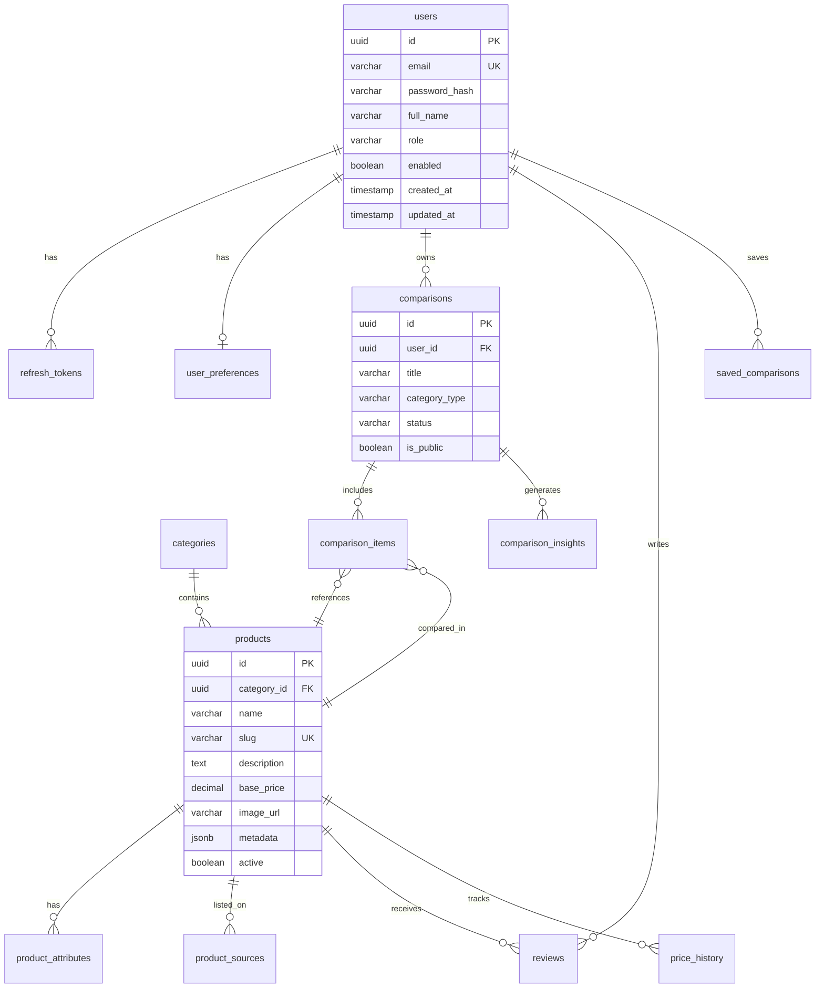

# BetterChoice AI — Database Schema

PostgreSQL 16. Naming: `snake_case` tables/columns, UUID primary keys, `created_at`/`updated_at` on all entities.

## ER Diagram



## Core Tables

### users

| Column | Type | Constraints |
|--------|------|-------------|
| id | UUID | PK, DEFAULT gen_random_uuid() |
| email | VARCHAR(255) | UNIQUE, NOT NULL |
| password_hash | VARCHAR(255) | NOT NULL |
| full_name | VARCHAR(150) | NOT NULL |
| role | VARCHAR(30) | NOT NULL, DEFAULT 'ROLE_USER' |
| enabled | BOOLEAN | DEFAULT true |
| email_verified | BOOLEAN | DEFAULT false |
| avatar_url | VARCHAR(500) | NULL |
| created_at | TIMESTAMPTZ | NOT NULL |
| updated_at | TIMESTAMPTZ | NOT NULL |

### refresh_tokens

| Column | Type | Constraints |
|--------|------|-------------|
| id | UUID | PK |
| user_id | UUID | FK → users(id) ON DELETE CASCADE |
| token_hash | VARCHAR(255) | UNIQUE, NOT NULL |
| expires_at | TIMESTAMPTZ | NOT NULL |
| revoked | BOOLEAN | DEFAULT false |
| created_at | TIMESTAMPTZ | NOT NULL |

### user_preferences

| Column | Type | Constraints |
|--------|------|-------------|
| id | UUID | PK |
| user_id | UUID | FK → users(id) UNIQUE |
| preferred_categories | JSONB | DEFAULT '[]' |
| budget_min | DECIMAL(12,2) | NULL |
| budget_max | DECIMAL(12,2) | NULL |
| notification_enabled | BOOLEAN | DEFAULT true |
| theme | VARCHAR(20) | DEFAULT 'light' |

### categories

| Column | Type | Constraints |
|--------|------|-------------|
| id | UUID | PK |
| name | VARCHAR(100) | NOT NULL |
| slug | VARCHAR(100) | UNIQUE |
| type | VARCHAR(50) | NOT NULL (PRODUCT, COLLEGE, RESTAURANT, etc.) |
| icon | VARCHAR(50) | NULL |
| parent_id | UUID | FK → categories(id) NULL |
| sort_order | INT | DEFAULT 0 |

### products

| Column | Type | Constraints |
|--------|------|-------------|
| id | UUID | PK |
| category_id | UUID | FK → categories(id) |
| name | VARCHAR(255) | NOT NULL |
| slug | VARCHAR(255) | UNIQUE |
| description | TEXT | NULL |
| base_price | DECIMAL(12,2) | NULL |
| currency | VARCHAR(3) | DEFAULT 'USD' |
| image_url | VARCHAR(500) | NULL |
| brand | VARCHAR(150) | NULL |
| rating_avg | DECIMAL(3,2) | DEFAULT 0 |
| review_count | INT | DEFAULT 0 |
| metadata | JSONB | DEFAULT '{}' |
| active | BOOLEAN | DEFAULT true |
| created_at | TIMESTAMPTZ | NOT NULL |
| updated_at | TIMESTAMPTZ | NOT NULL |

### product_attributes

Flexible key-value specs (screen size, cuisine type, tuition, etc.)

| Column | Type | Constraints |
|--------|------|-------------|
| id | UUID | PK |
| product_id | UUID | FK → products(id) ON DELETE CASCADE |
| attribute_key | VARCHAR(100) | NOT NULL |
| attribute_value | TEXT | NOT NULL |
| display_order | INT | DEFAULT 0 |

**Unique:** (product_id, attribute_key)

### product_sources

External platform listings (Amazon, Yelp, Coursera, etc.)

| Column | Type | Constraints |
|--------|------|-------------|
| id | UUID | PK |
| product_id | UUID | FK → products(id) ON DELETE CASCADE |
| platform | VARCHAR(50) | NOT NULL |
| external_id | VARCHAR(255) | NOT NULL |
| url | VARCHAR(500) | NULL |
| price | DECIMAL(12,2) | NULL |
| last_synced_at | TIMESTAMPTZ | NULL |

**Unique:** (platform, external_id)

### comparisons

| Column | Type | Constraints |
|--------|------|-------------|
| id | UUID | PK |
| user_id | UUID | FK → users(id) |
| title | VARCHAR(255) | NOT NULL |
| category_type | VARCHAR(50) | NOT NULL |
| status | VARCHAR(30) | DRAFT, COMPLETED, ARCHIVED |
| is_public | BOOLEAN | DEFAULT false |
| share_token | VARCHAR(64) | UNIQUE, NULL |
| created_at | TIMESTAMPTZ | NOT NULL |
| updated_at | TIMESTAMPTZ | NOT NULL |

### comparison_items

| Column | Type | Constraints |
|--------|------|-------------|
| id | UUID | PK |
| comparison_id | UUID | FK → comparisons(id) ON DELETE CASCADE |
| product_id | UUID | FK → products(id) |
| position | INT | NOT NULL |
| notes | TEXT | NULL |

**Unique:** (comparison_id, product_id)

### comparison_insights

AI-generated analysis stored for caching and history.

| Column | Type | Constraints |
|--------|------|-------------|
| id | UUID | PK |
| comparison_id | UUID | FK → comparisons(id) ON DELETE CASCADE |
| insight_type | VARCHAR(50) | SUMMARY, PROS_CONS, WINNER, SENTIMENT |
| content | JSONB | NOT NULL |
| model_version | VARCHAR(50) | NULL |
| tokens_used | INT | NULL |
| created_at | TIMESTAMPTZ | NOT NULL |

### reviews

| Column | Type | Constraints |
|--------|------|-------------|
| id | UUID | PK |
| product_id | UUID | FK → products(id) |
| user_id | UUID | FK → users(id) |
| rating | SMALLINT | CHECK (1-5) |
| title | VARCHAR(200) | NULL |
| body | TEXT | NOT NULL |
| verified_purchase | BOOLEAN | DEFAULT false |
| sentiment_score | DECIMAL(4,3) | NULL (Phase 2) |
| is_fake_flagged | BOOLEAN | DEFAULT false |
| moderation_status | VARCHAR(30) | PENDING, APPROVED, REJECTED |
| created_at | TIMESTAMPTZ | NOT NULL |

**Unique:** (product_id, user_id)

### saved_comparisons

| Column | Type | Constraints |
|--------|------|-------------|
| id | UUID | PK |
| user_id | UUID | FK → users(id) |
| comparison_id | UUID | FK → comparisons(id) |
| created_at | TIMESTAMPTZ | NOT NULL |

**Unique:** (user_id, comparison_id)

### search_queries (analytics)

| Column | Type | Constraints |
|--------|------|-------------|
| id | UUID | PK |
| user_id | UUID | FK → users(id) NULL |
| query_text | VARCHAR(500) | NOT NULL |
| category_type | VARCHAR(50) | NULL |
| result_count | INT | NULL |
| created_at | TIMESTAMPTZ | NOT NULL |

### price_history (Phase 3)

| Column | Type | Constraints |
|--------|------|-------------|
| id | UUID | PK |
| product_id | UUID | FK → products(id) |
| source_id | UUID | FK → product_sources(id) NULL |
| price | DECIMAL(12,2) | NOT NULL |
| recorded_at | TIMESTAMPTZ | NOT NULL |

## Indexes

```sql
CREATE INDEX idx_products_category ON products(category_id);
CREATE INDEX idx_products_name_trgm ON products USING gin(name gin_trgm_ops);
CREATE INDEX idx_products_metadata ON products USING gin(metadata);
CREATE INDEX idx_comparisons_user ON comparisons(user_id);
CREATE INDEX idx_reviews_product ON reviews(product_id);
CREATE INDEX idx_product_sources_platform ON product_sources(platform, external_id);
CREATE INDEX idx_search_queries_created ON search_queries(created_at DESC);
CREATE INDEX idx_price_history_product_date ON price_history(product_id, recorded_at DESC);
```

Enable extension: `CREATE EXTENSION IF NOT EXISTS pg_trgm;`

## Enums (Java)

```java
public enum Role { ROLE_USER, ROLE_PREMIUM, ROLE_ADMIN }
public enum CategoryType { PRODUCT, COLLEGE, RESTAURANT, COURSE, COMPANY, SALARY, HOTEL, SERVICE }
public enum ComparisonStatus { DRAFT, COMPLETED, ARCHIVED }
public enum ModerationStatus { PENDING, APPROVED, REJECTED }
```

Stored as `VARCHAR` in DB for migration flexibility.
